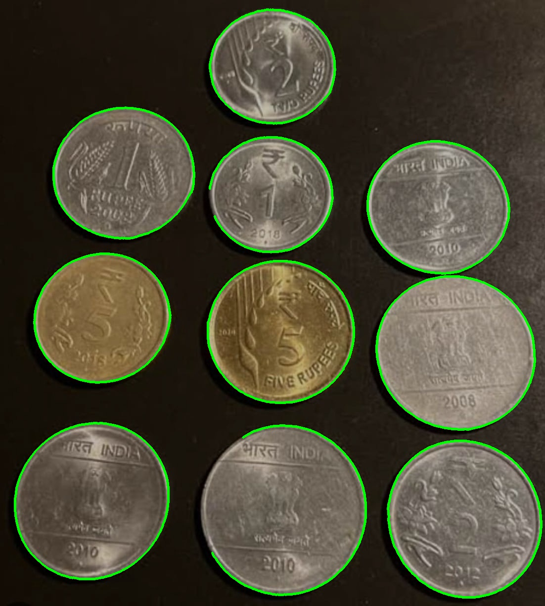
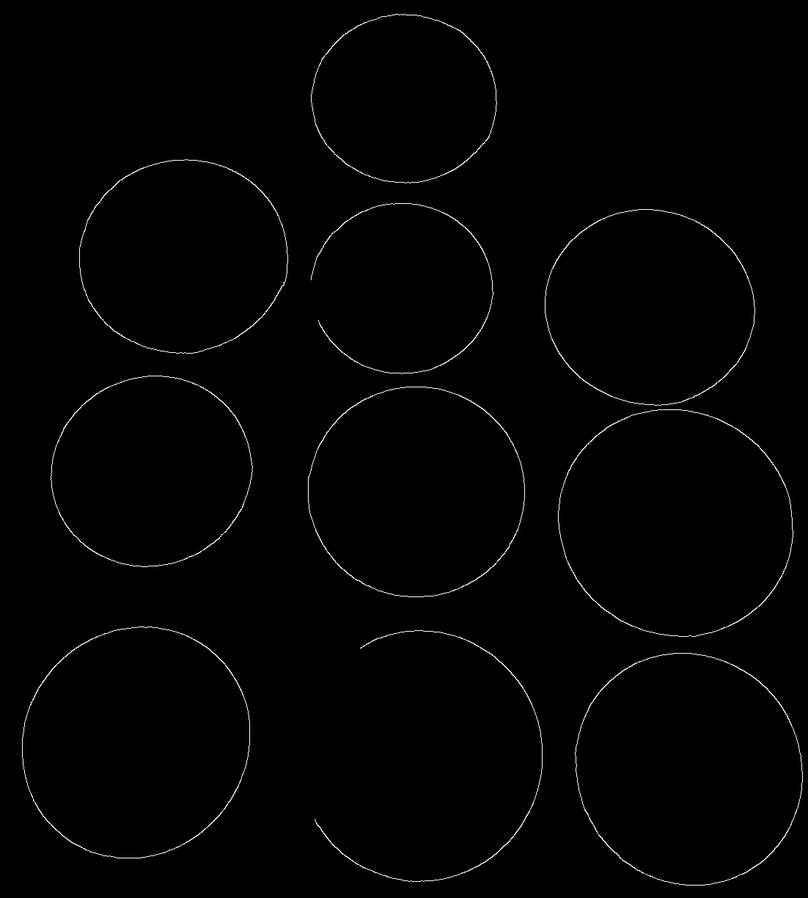

# VR_Assignment_1_Snigdha_IMT2022571

## Coin edge detection, segmentation and counting

### Edge Based detection using contours

1. Preprocessing and Edge Detection - 
    - Grayscale Conversion: The input image is first converted to grayscale using cv2.cvtColor(image, cv2.COLOR_BGR2GRAY). This step simplifies the image by removing color information, making it easier to process.
    - Gaussian Blur for Noise Reduction: A Gaussian blur is applied with cv2.GaussianBlur(gray, (11, 11), 0).The blurring smoothens variations in pixel intensities, reducing noise and making edge detection more reliable. Larger kernel sizes (like (11, 11)) provide stronger smoothing, but excessive blurring may remove weak edges.
    - Canny Edge Detection: Edges are detected using cv2.Canny(blurred, 50, 234), which applies gradient-based edge detection. The first threshold (50) filters weak edges, and the second threshold (234) filters out insignificant edges. This helps in detecting the circular boundaries of the coins while ignoring unwanted noise.
2. Contour Detection and Extraction - 
    - Finding Contours: cv2.findContours(edges, cv2.RETR_EXTERNAL, cv2.CHAIN_APPROX_SIMPLE) extracts the outermost contours from the detected edges. Contours represent the boundaries of objects (coins) in the image.
    - Drawing Contours on the Image: cv2.drawContours(output, contours, -1, (0, 255, 0), 3) overlays the detected contours on the original image in green. This visualization confirms whether the contours correctly enclose the coin boundaries.
    - Extracting Individual Coins: Each detected coin is cropped using cv2.boundingRect(contour), and saved as a separate image. This segmentation isolates each coin for further processing or analysis.

### Region based segmentation using thresholding and morphological operations

- Otsu’s Thresholding for Foreground Extraction: cv2.threshold(blurred, 0, 255, cv2.THRESH_BINARY + cv2.THRESH_OTSU) automatically finds an optimal threshold to separate coins from the background. This converts the image into a binary format (white foreground, black background), making segmentation easier.

- Morphological Operations for Noise Removal: cv2.morphologyEx(binary, cv2.MORPH_OPEN, kernel, iterations=2) applies an opening operation (erosion followed by dilation). This removes small noise patches while preserving the shape of coins.

- Connected Component Labeling: measure.label(cleaned, connectivity=2) labels each distinct connected region in the binary image. This step helps identify individual coins and separate them from the background.

- Removing Small Objects: morphology.remove_small_objects(labels, min_size=2000) eliminates small regions that are unlikely to be coins. This ensures that only sufficiently large objects are considered as valid coin detections.

- Colorizing the Segmented Coins: color.label2rgb(labels, bg_label=0) assigns unique colors to different detected regions. This helps in visually distinguishing each segmented coin.

- Counting the Total Number of Coins: len(np.unique(labels)) - 1 counts the total segmented regions while excluding the background. This provides an automatic way to count the number of coins in the image.

### Dependencies and Installations

OpenCV, NumPy, OS, Shutil, Matplotlib, Scikit-Image

```bash
pip install opencv-python numpy matplotlib scikit-image
```
Ensure the input images are available in the input_images directory. Run the following command to execute the code:

```bash
python3 Q1.py
```

Output files generated will be available in the output_images directory.

### Original Image


### Output Images




```
[Edge Detection + Contour] Total number of coins detected: 10
[Segmentation] Total Coins Detected: 10
```

## Image Stitching - Panorama Generation

This script stitches multiple images into a seamless panorama using feature detection, homography estimation, and warping techniques.

### Steps Involved

1. Preprocessing & Loading Images
    - Reads all images from the `input_images/` directory that contain `_panorama` in their filename.
    - Resizes images to a fixed width (800 pixels) while maintaining the aspect ratio.

2. Feature Detection and Matching
    - Detects keypoints and computes descriptors using SIFT(Scale-Invariant Feature Transform).
    - Uses the Brute-Force Matcher (BFMatcher) with L2 norm to find feature correspondences between consecutive images.
    - Saves keypoint visualizations for reference.

3. Homography Estimation & Warping
    - Computes homography using RANSAC to estimate the transformation between images.
    - Warps images to align them and blends them into a single panoramic image.

4. Trimming Black Borders
    - Identifies and removes unnecessary black areas in the final stitched panorama.

5. Saving and Displaying Output
    - The final stitched image is saved in the `output_images/` directory as `stitched_panorama.jpg`.
    - The result is displayed using Matplotlib.

### Dependencies and Installations

OpenCV, NumPy, Matplotlib, and Glob

```bash
pip install opencv-python numpy matplotlib
```

Ensure the input images are available in the input_images directory. Run the following command to execute the code:

```bash
python3 Q2_1.py
```

** Q2.py uses Stitcher API.

Output files generated will be available in the output_images directory.

### Original Images


### Output Images


